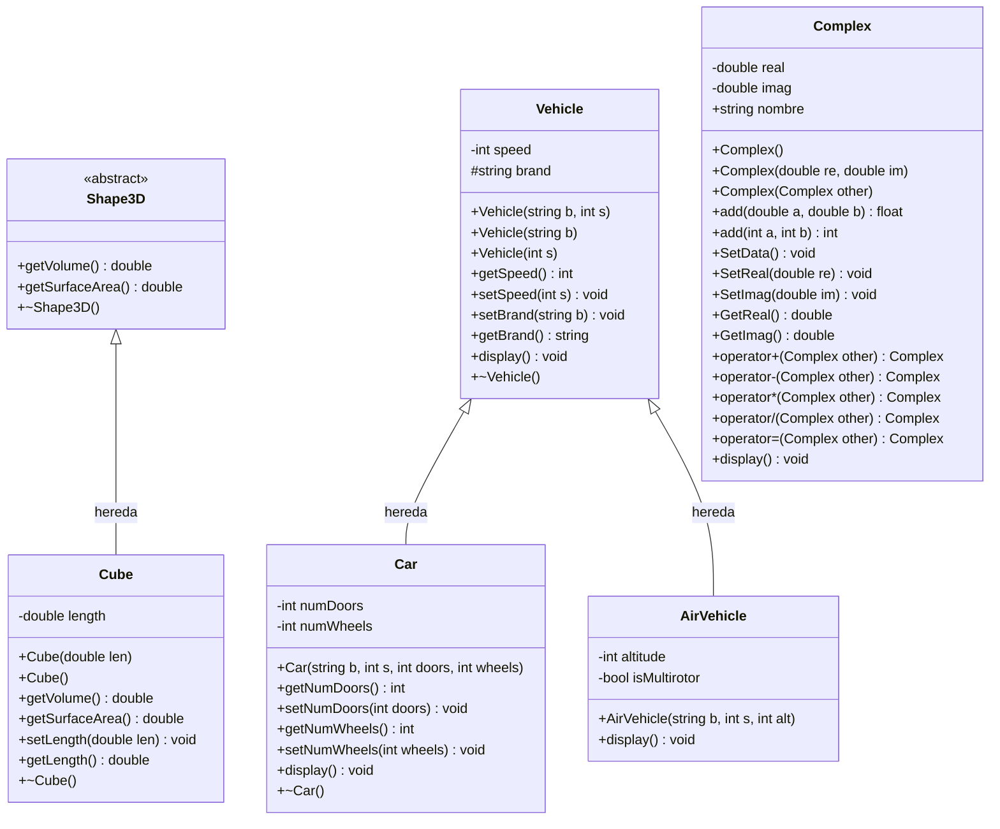

# Diagrama UML - Clases de Ejemplo

## Descripción
Diagrama de clases basado en el repositorio [ALSE-2025-2-G1/EjemploClases](https://github.com/DanielPalominoS/ALSE-2025-2-G1/tree/main/EjemploClases)

## Diagrama

## Clases identificadas

### Jerarquía Shape3D
- **Shape3D** (clase abstracta)
  - **Cube** (hereda de Shape3D)

### Jerarquía Vehicle
- **Vehicle** (clase base)
  - **Car** (hereda de Vehicle)
  - **AirVehicle** (hereda de Vehicle)

### Clase independiente
- **Complex** (números complejos con sobrecarga de operadores)
